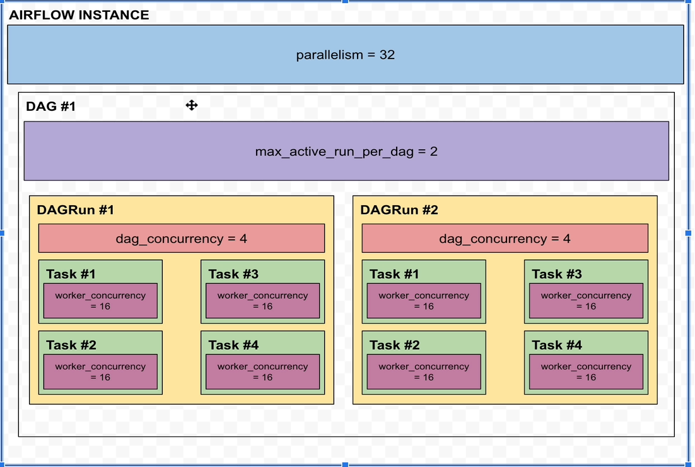
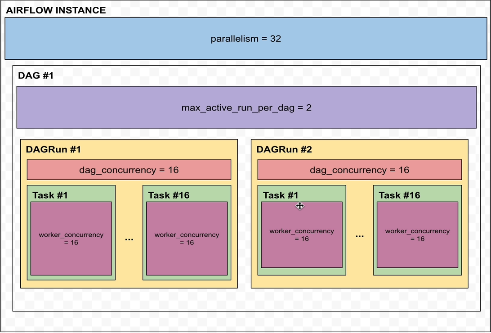

# Distributing tasks with the Celery Executor
- We are now having Airflow cluster running with Celery executor
- Run
```
docker ps
```
- Open Airflow UI
- Open new tab and open localhost:5555
- Open Airflow UI
- Enable parallel_dag
- Refresh until first task is executed
- As this DAG has catchup to True, a lot of DAG runs will be triggered. We can review the result properly now
- Let's review flower dashboard
  - Review 8 columns
    - Worker name
    - Status
    - Active
    - Processed
    - Failed
    - Succeeded
    - Retrieved
    - Load Average
      - Shows the number of active processes averaged over the last 1,5 and 15 minutes respectively
      - These numbers give information about the system load of your worker
      - Since each CPU Core can handle one process at a time, the system is not overloaded until it goes over 1.0 per logical processor
      - For example if I have 8 cores on my worker, as along as these numbers stay below 8, my worker is fine
      - If we have dual core processor, as long as theses numbers stay below 2, your worker is fine and so on
      -Usually it's ok if the load average is above 1.0 per core in the last minute mark
      - But if we get more in 5 and 15 minutes averages, that could indicate a problem
      - As a solution we could find the CPU intensive tasks and forward them to a worker having more CPUs, decrease the paralalism parameters in order to execute less tasks or add more resources to the worker.
      - As we already have processed and succeeded tasks, but if you look at the Active column, the number of active tasks never goes above 2 as dag_concurrency is 2
  - Open worker details by clicking on the worker's name
  - Notice the various details in different tabs
- Let's change the parallelism parameter to increase the number of executed tasks allowed to run at the same time
  - airflow.cfg -> parallelism = 16, dag_concurrency = 16
- Restart
```
docker-compose -f docker-compose-CeleryExecutor.yml down
docker-compose -f docker-compose-CeleryExecutor.yml up -d
docker ps
```
- Open Airflow UI and refresh
- Enable parallel_dag and refresh page
- Open flower UI
- Notice Active column. More than 2 tasks are active
- The number of active tasks at the same time depends on the dependencies of your DAG and if multiple DAG runs are running at the same time.
- Set max_active_runs_per_dag = 16
- Restart Airflow UI
```
docker-compose -f docker-compose-CeleryExecutor.yml down
docker-compose -f docker-compose-CeleryExecutor.yml up -d
docker ps
```
- Enable parallel_dag and refresh page
- Open flower UI
- Notice Active column. More than 16 tasks are active
- Refer to the parameter in airflow.cfg - worker_concurrency
  - Determines how many tasks a single worker can process. By default it is set to 16
  - If we have 4 workers, we can execute upto 64 tasks at a time
  - However if the parameter - parallelism = 16 then only 16 tasks would actually run in parallel and not 64
  - Likewise, if dag_concurrency = 5 then only 5 tasks will be able to run in parallel for a given DAGRun in our workers.
  - For worker_concurrency parameter, more processes are usually the better but there is a cut-off point where adding more processed affects performance in negative ways. You need to make your experiments to find the number that works best for us
- Refer below diagram for better understanding
- The parameters in the diagram are ordered according to the priority

- In above diagram:
  - parallalism = 32:  Upto 32 tasks will run in parallel
  - max_active_runs_per_dag = 2: Only 2 DAG runs of the same DAG will be able to run at any time
  - dag_concurrency = 4: Upto 4 tasks can be executed in parallel within the same DAGRun even if the parameter worker_concurrency = 16


- In above diagram:
  - dag_concurrency = 16: 32 tasks will be able to run in a concurrent manner
    - 16 in DAGRun 1
    - 16 in DAGRun 2

- Decrease and set worker_concurrency = 1 to see the impact
- Restart Airflow UI
```
docker-compose -f docker-compose-CeleryExecutor.yml down
docker-compose -f docker-compose-CeleryExecutor.yml up -d
docker ps
```
- Open Airflow UI
- Enable parallel_dag
- Refresh page
- Open flower dashboard
  - Active column has only one task as Active as we set worker_concurrency = 1
  - By adding a new worker, we should be able to execute 2 tasks in parallel.
- Stop Airflow UI
```
docker-compose -f docker-compose-CeleryExecutor.yml up -d
docker ps
```
